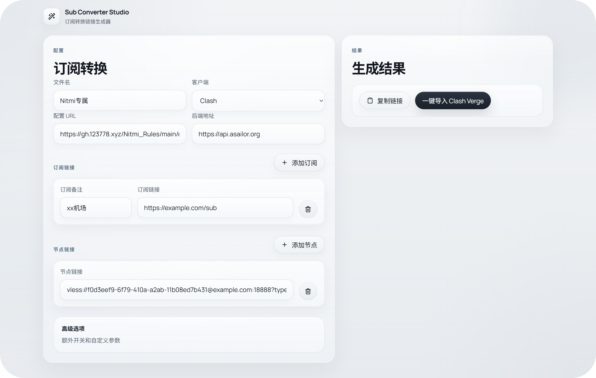

# Sub Converter Studio

订阅转换前端页面，适配 [SubConverter-Extended](https://github.com/Aethersailor/SubConverter-Extended)，支持可视化配置 `proxy-providers` 并生成最终转换链接。

<p align="center">
  
</p>

## 特性

- 适配 [SubConverter-Extended](https://github.com/Aethersailor/SubConverter-Extended)
- 可视化配置订阅链接与 `proxy-providers`
- 单独录入节点链接
- 生成订阅转换链接并支持一键导入部分客户端

## 技术栈

 **Vite** + **React** + **TypeScript**

## 本地开发

```bash
pnpm install
pnpm dev
```

## 构建

```bash
pnpm build
```

## 部署到 Vercel

[](https://vercel.com/new/clone?repository-url=https://github.com/Nitmi/Sub-Converter-Studio)

## 相关项目

- 订阅转换后端增强版: [Aethersailor/SubConverter-Extended](https://github.com/Aethersailor/SubConverter-Extended)
- 订阅转换配置: [Nitmi/Nitmi_Rules](https://github.com/Nitmi/Nitmi_Rules)
